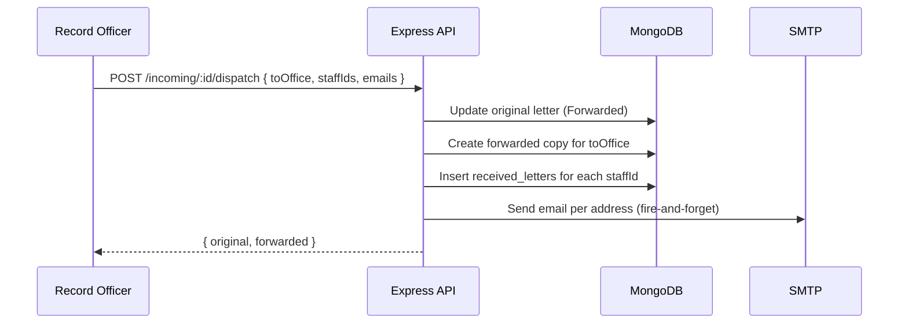

# Design Document: LMS Extensions

## Overview

This document describes the technical design for three additive extensions to the Letter Management System (LMS):

1. **Staff Inbox System** — a personal inbox for staff members to receive and track letters dispatched to them by the Record Officer.
2. **Admin-Controlled Password Reset** — an admin-initiated password reset flow with forced change-on-login enforcement.
3. **No-Reply Email Integration** — optional email delivery of dispatched letters to external recipients via SMTP/Nodemailer.

All three features are strictly additive. They extend existing modules without altering the core letter storage schema or existing API contracts.

---

## Architecture

The system follows the existing layered architecture:

```
React Frontend (Vite)
  └── lms/src/
        ├── pages/         ← new: Inbox.jsx, ChangePassword.jsx
        ├── components/    ← modified: Sidebar.jsx
        ├── context/       ← modified: AppContext.jsx
        └── lib/api.js     ← extended

Express Backend (Node.js)
  └── server/
        ├── routes/
        │     ├── incoming.js   ← modified: dispatch handler extended
        │     ├── auth.js       ← modified: login + change-password
        │     ├── users.js      ← modified: reset-password endpoint
        │     └── inbox.js      ← new router
        ├── models/
        │     ├── User.js            ← extended: 2 new boolean fields
        │     └── ReceivedLetter.js  ← new Mongoose model
        └── services/
              └── emailService.js    ← new Nodemailer wrapper

MongoDB
  ├── users              ← extended (additive only)
  ├── incomingletters    ← unchanged
  └── received_letters   ← new collection
```



---

## Components and Interfaces

### Backend

#### ReceivedLetter Model (`server/models/ReceivedLetter.js`)

New Mongoose model for the `received_letters` collection.

#### Inbox Routes (`server/routes/inbox.js`)

New Express router mounted at `/api/inbox`.

| Method | Path | Auth | Description |
|--------|------|------|-------------|
| GET | `/api/inbox` | required | Returns all received_letters for the authenticated user, populated, sorted by createdAt desc |
| PATCH | `/api/inbox/:id/read` | required | Sets isRead = true; returns 403 if record does not belong to caller |

#### Dispatch Handler Extension (`server/routes/incoming.js`)

The existing `POST /:id/dispatch` handler is extended to:
- Accept optional `staffIds` (array of User ObjectIds) and `emails` (array of strings) in the request body.
- After existing dispatch logic, call inbox insertion for each staffId.
- Call `emailService.sendDispatchEmails(emails, letter)` as a fire-and-forget operation (errors caught and logged, never propagated).

#### User Model Extension (`server/models/User.js`)

Two new fields appended to `UserSchema` — no existing fields modified:
- `mustChangePassword: { type: Boolean, default: false }`
- `canResetPassword: { type: Boolean, default: false }`

#### Reset Password Endpoint (`server/routes/users.js`)

New route `POST /api/users/:id/reset-password`:
- Authorized if `req.user.role === 'admin'` OR `req.user.canResetPassword === true`.
- Generates a random 8+ character alphanumeric password.
- Hashes with bcrypt, saves, sets `mustChangePassword = true`.
- Returns `{ tempPassword }` in the response.

#### Auth Controller Extensions (`server/routes/auth.js`)

- `POST /api/auth/login`: Include `mustChangePassword` and `canResetPassword` in both the JWT payload and the response body.
- `POST /api/auth/change-password`: Authenticated endpoint. Accepts `{ newPassword }`, validates length >= 6, hashes, saves, sets `mustChangePassword = false`.

#### Email Service (`server/services/emailService.js`)

Thin Nodemailer wrapper:
- Reads `SMTP_HOST`, `SMTP_PORT`, `SMTP_USER`, `SMTP_PASS`, `SMTP_FROM` from `process.env`.
- Exports `sendDispatchEmails(emails, letter)` — iterates addresses, sends each, catches per-address errors and logs them without throwing.

### Frontend

#### Inbox Page (`lms/src/pages/Inbox.jsx`)

- Route: `/inbox`
- Fetches `GET /api/inbox` on mount.
- Renders a list of inbox records; unread items are visually highlighted (distinct background/font-weight).
- "View" button calls `PATCH /api/inbox/:id/read` then navigates to `/incoming?id=<letterId>`.

#### Change Password Page (`lms/src/pages/ChangePassword.jsx`)

- Route: `/change-password`
- Accessible only to authenticated users.
- Submits `POST /api/auth/change-password`.
- On success, clears `mustChangePassword` from session and redirects to `/`.

#### Sidebar Extension (`lms/src/components/Sidebar.jsx`)

- Adds an "Inbox" nav item (Inbox icon, route `/inbox`) visible to all authenticated users.
- Shows an unread count badge when there are unread inbox records.

#### AppContext Extensions (`lms/src/context/AppContext.jsx`)

- `login()`: After successful login, if `mustChangePassword` is true in the response, store the flag in session and redirect to `/change-password`.
- Expose `canResetPassword` from the JWT/session for conditional rendering.
- Route guard: if `user.mustChangePassword` is true, redirect any non-`/change-password` navigation to `/change-password`.

#### Users Page Extension (`lms/src/pages/Users.jsx`)

- Adds a toggle (checkbox or switch) per user row for `canResetPassword`.
- On toggle, calls `PUT /api/users/:id` with `{ canResetPassword: <bool> }`.
- The existing "Reset Password" button is updated to call `POST /api/users/:id/reset-password` and display the returned `tempPassword`.

#### Dispatch Modal Extension (`lms/src/pages/IncomingLetters.jsx`)

- Adds an optional "Staff Recipients" multi-select (user picker filtered to the target office) to populate `staffIds`.
- Adds an optional "External Email Addresses" text input (comma-separated) to populate `emails`.

#### API Client Extension (`lms/src/lib/api.js`)

```js
getInbox:          ()              => request('GET',   '/inbox'),
markInboxRead:     (id)            => request('PATCH', `/inbox/${id}/read`),
resetUserPassword: (id)            => request('POST',  `/users/${id}/reset-password`),
changePassword:    (newPassword)   => request('POST',  '/auth/change-password', { newPassword }),
```

---

## Data Models

### ReceivedLetter (new)

```js
{
  userId:    { type: ObjectId, ref: 'User',           required: true, index: true },
  letterId:  { type: ObjectId, ref: 'IncomingLetter', required: true },
  isRead:    { type: Boolean,  default: false },
  createdAt: { type: Date,     default: Date.now }
}
```

Collection name: `received_letters`

### User (extended — additive only)

Two new fields appended to the existing `UserSchema`. No existing fields are modified.

```js
mustChangePassword: { type: Boolean, default: false },
canResetPassword:   { type: Boolean, default: false },
```

### JWT Payload (extended)

```js
{ id, name, role, office, avatar, email, canAddUsers, mustChangePassword, canResetPassword }
```

---

## Correctness Properties

*A property is a characteristic or behavior that should hold true across all valid executions of a system — essentially, a formal statement about what the system should do. Properties serve as the bridge between human-readable specifications and machine-verifiable correctness guarantees.*

### Property 1: Inbox record count matches staffIds

*For any* dispatch request that includes a `staffIds` array of length N, exactly N `received_letters` records should be created in the database, one per entry in `staffIds`.

**Validates: Requirements 1.3**

---

### Property 2: GET /inbox returns only the caller's records

*For any* authenticated user U, `GET /api/inbox` should return only `received_letters` records where `userId` equals U's id — never records belonging to other users.

**Validates: Requirements 1.5**

---

### Property 3: GET /inbox is sorted by createdAt descending

*For any* authenticated user with multiple inbox records, the records returned by `GET /api/inbox` should be ordered such that each record's `createdAt` is greater than or equal to the next record's `createdAt`.

**Validates: Requirements 1.5**

---

### Property 4: Mark-read round trip

*For any* `received_letters` record R belonging to user U, after U calls `PATCH /api/inbox/R._id/read`, fetching R again should show `isRead === true`.

**Validates: Requirements 1.6**

---

### Property 5: Cross-user mark-read is forbidden

*For any* two distinct users U1 and U2, and any `received_letters` record R belonging to U1, when U2 calls `PATCH /api/inbox/R._id/read`, the API should return HTTP 403 and R's `isRead` should remain unchanged.

**Validates: Requirements 1.7**

---

### Property 6: Inbox population includes required fields

*For any* `received_letters` record returned by `GET /api/inbox`, the populated `letterId` object should contain all five fields: `refNo`, `subject`, `sender`, `priority`, and `attachments`.

**Validates: Requirements 1.8**

---

### Property 7: Inbox page displays all user records

*For any* set of N inbox records belonging to the authenticated user, the rendered Inbox page should display exactly N items.

**Validates: Requirements 2.2**

---

### Property 8: Unread and read records are visually distinct

*For any* inbox page render containing both read and unread records, the DOM elements for unread records should have a different CSS class or style attribute than those for read records.

**Validates: Requirements 2.3**

---

### Property 9: mustChangePassword flag propagates through login

*For any* user whose `mustChangePassword` field is `true` in the database, the `POST /api/auth/login` response body should contain `mustChangePassword: true`.

**Validates: Requirements 5.1**

---

### Property 10: Change-password clears the forced-change flag

*For any* user with `mustChangePassword === true`, after successfully calling `POST /api/auth/change-password` with a valid new password, the user's `mustChangePassword` field in the database should be `false`, and the new password should authenticate successfully via login.

**Validates: Requirements 5.4**

---

### Property 11: Short passwords are rejected by change-password

*For any* password string with length less than 6, `POST /api/auth/change-password` should return HTTP 400 and the user's password in the database should remain unchanged.

**Validates: Requirements 5.5**

---

### Property 12: mustChangePassword guard blocks all other routes

*For any* authenticated user with `mustChangePassword === true`, attempting to navigate to any route other than `/change-password` should result in a redirect to `/change-password`.

**Validates: Requirements 5.6**

---

### Property 13: Generated reset password is valid and stored correctly

*For any* call to `POST /api/users/:id/reset-password` by an authorized user, the `tempPassword` returned in the response should be a string of length >= 8 composed only of alphanumeric characters (A-Z, a-z, 0-9), and `bcrypt.compare(tempPassword, user.password)` should return `true`.

**Validates: Requirements 4.2, 4.3**

---

### Property 14: Reset sets mustChangePassword and preserves other fields

*For any* user U, after a successful `POST /api/users/:id/reset-password`, U's `mustChangePassword` should be `true`, and all other fields on U (name, role, office, email, canResetPassword, etc.) should be identical to their pre-reset values.

**Validates: Requirements 4.4, 4.7**

---

### Property 15: Unauthorized reset is rejected

*For any* requesting user whose `role` is not `admin` and whose `canResetPassword` is `false`, calling `POST /api/users/:id/reset-password` should return HTTP 403 and the target user's document should be unchanged.

**Validates: Requirements 4.6, 6.4**

---

### Property 16: canResetPassword is included in the JWT

*For any* user U, after `POST /api/auth/login`, the decoded JWT payload should contain a `canResetPassword` field equal to U's `canResetPassword` value in the database.

**Validates: Requirements 6.5**

---

### Property 17: Email count matches addresses array

*For any* dispatch request that includes an `emails` array of length N (N > 0), exactly N emails should be sent via the SMTP transport, each to a distinct address from the array.

**Validates: Requirements 7.2**

---

### Property 18: Dispatch succeeds even when email delivery fails

*For any* dispatch request where the SMTP transport throws an error for one or more addresses, the HTTP response from `POST /incoming/:id/dispatch` should still be HTTP 200 with the expected `{ original, forwarded }` payload.

**Validates: Requirements 7.4**

---

### Property 19: Emails are sent from SMTP_FROM, not staff addresses

*For any* email sent by the Email_Service, the `From` header should equal the value of the `SMTP_FROM` environment variable and should not contain any user's personal email address.

**Validates: Requirements 7.5**

---

## Error Handling

| Scenario | Behavior |
|----------|----------|
| `staffIds` contains an invalid/non-existent user ID | Skip that entry; log a warning; do not fail the dispatch |
| SMTP send failure for one address | Log error, continue to next address; dispatch response unaffected |
| SMTP transport misconfigured (missing env vars) | Email_Service logs a startup warning; dispatch proceeds without email |
| `PATCH /inbox/:id/read` on non-existent record | Return HTTP 404 |
| `PATCH /inbox/:id/read` by wrong user | Return HTTP 403 |
| `POST /api/auth/change-password` with password < 6 chars | Return HTTP 400 with message "Password must be at least 6 characters." |
| `POST /api/users/:id/reset-password` by unauthorized user | Return HTTP 403 |
| `POST /api/users/:id/reset-password` for non-existent user | Return HTTP 404 |
| JWT missing `mustChangePassword` (old tokens) | Frontend treats absence as `false`; no forced redirect |

---

## Testing Strategy

### Dual Testing Approach

Both unit tests and property-based tests are required. Unit tests cover specific examples, integration points, and error conditions. Property-based tests verify universal correctness across randomized inputs. Together they provide comprehensive coverage.

### Unit Tests

- `ReceivedLetter` model: default field values, required field validation.
- `GET /api/inbox`: returns empty array for user with no records; returns populated records.
- `PATCH /api/inbox/:id/read`: marks record read; returns 403 for wrong user; returns 404 for missing record.
- `POST /api/users/:id/reset-password`: returns 403 for unauthorized caller; returns 404 for missing user.
- `POST /api/auth/change-password`: returns 400 for short password; clears `mustChangePassword` on success.
- `POST /api/auth/login`: includes `mustChangePassword: true` when flag is set; includes `canResetPassword`.
- Email_Service: does not throw when SMTP fails; calls `transporter.sendMail` once per address.
- Inbox page: renders "Inbox" link in sidebar; renders unread badge when unread records exist.
- Change-password page: redirects to `/` on success; shows error for short password.
- `/change-password` route: redirects unauthenticated users to login.

### Property-Based Tests

Use **fast-check** (both frontend and backend). Each property test must run a minimum of **100 iterations**.

Tag format: `// Feature: lms-extensions, Property <N>: <property_text>`

| Property | PBT Pattern | Notes |
|----------|-------------|-------|
| P1: Inbox record count matches staffIds | Invariant | Generate random staffIds arrays of varying length |
| P2: GET /inbox returns only caller's records | Invariant | Generate multiple users with overlapping inbox records |
| P3: GET /inbox sorted descending | Invariant | Generate records with random createdAt values |
| P4: Mark-read round trip | Round Trip | Generate random inbox records |
| P5: Cross-user mark-read returns 403 | Error Condition | Generate pairs of distinct users |
| P6: Inbox population includes required fields | Invariant | Generate random letters and inbox records |
| P7: Inbox page displays all records | Invariant | Generate random inbox record arrays |
| P8: Unread/read visual distinction | Invariant | Generate mixed read/unread record sets |
| P9: mustChangePassword in login response | Invariant | Generate users with mustChangePassword = true |
| P10: Change-password clears flag | Round Trip | Generate valid new passwords |
| P11: Short passwords rejected | Error Condition | Generate strings with length 0-5 |
| P12: Route guard redirects | Invariant | Generate random route paths |
| P13: Generated password is valid alphanumeric >= 8 chars | Invariant | Run reset N times, check each result |
| P14: Reset preserves other fields | Invariant | Generate random user documents |
| P15: Unauthorized reset returns 403 | Error Condition | Generate users without admin/canResetPassword |
| P16: canResetPassword in JWT | Round Trip | Generate users with both true/false values |
| P17: Email count matches addresses | Invariant | Generate random email address arrays |
| P18: Dispatch succeeds despite email failure | Invariant | Mock SMTP to throw; verify dispatch response |
| P19: From header equals SMTP_FROM | Invariant | Generate random SMTP_FROM values |
